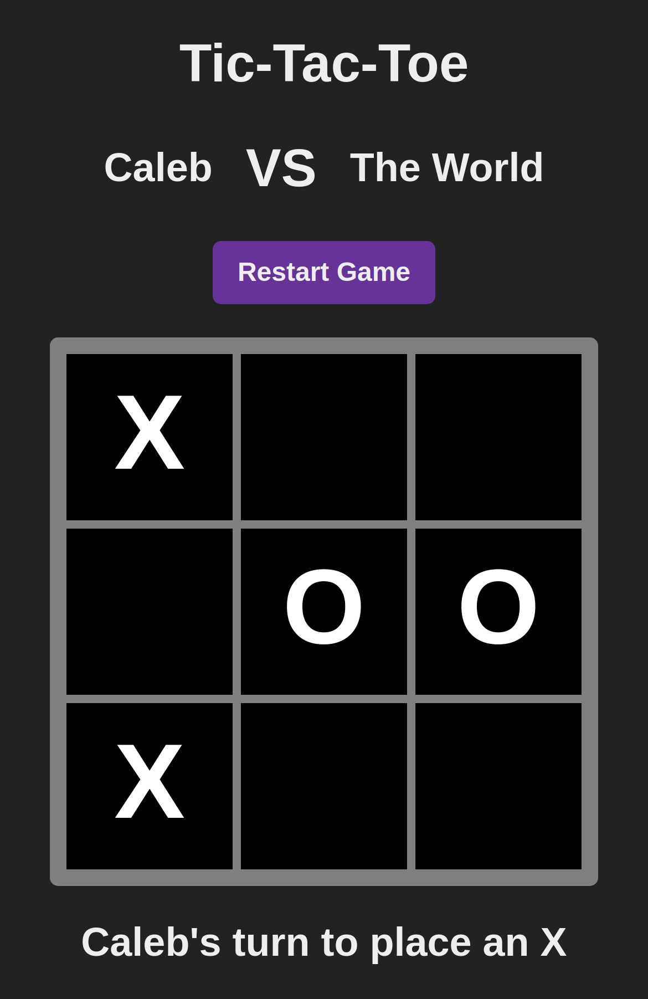

# tic-tac-toe
### Play it here: [calebscode.github.io/tic-tac-toe]()
Play tic-tac-toe with a friend!

Made using vanilla HTML/CSS/JavaSCript.

Created as part of The Odin Project curriculum in the Javascript course.

# Features
- Basic gameplay loop
- Can change player's names
- Can restart at any point
- Detects wins and stalemates automatically
- Is implemented using the module/IIFE pattern! Yay!!

# Screenshot

Here's what it looks like in case that's all you care about. Styling on this one was not a priority. The Javascript was the learning point in this project.

